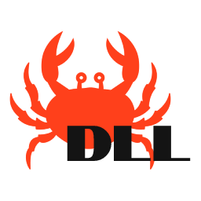
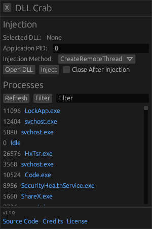

<!--
 Copyright (c) 2022 aiocat

 This software is released under the MIT License.
 https://opensource.org/licenses/MIT
-->

# DLL Crab

Rusty DLL Injector with GUI

## Screenshot

*(UI is same with v1.2.0)*

## Why?

Because I can't find a GUI DLL Injector that written in Rust. and I decided to made an one.

## Methods

- CreateRemoteThread
- RtlCreateUserThread
- QueueUserAPC

## Download

You can download latest release from [here](https://github.com/aiocat/dll-crab/releases/latest).

## Technologies

- Rust for Everything
- `egui` for GUI

## Contributing

All pull-requests and issues are welcome. Just make sure you got a brain.

If you got an error, Please open an issue at [here](https://github.com/aiocat/dll-crab/issues).

## Building

### Pre-Requests

- Rust compiler and Cargo must be installed to your computer

### Progress

- Clone the repo (`git clone git@github.com:aiocat/dll-crab.git`)
- Move into folder (`cd dll-crab`)
- Run cargo build (`cargo build --release`)

## License

DLL Crab is distributed under MIT license. for more information:

- https://raw.githubusercontent.com/aiocat/dll-crab/main/LICENSE
